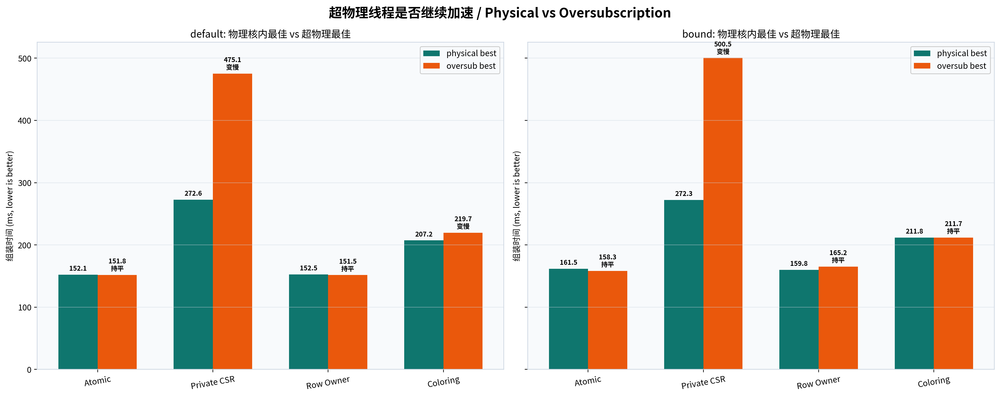
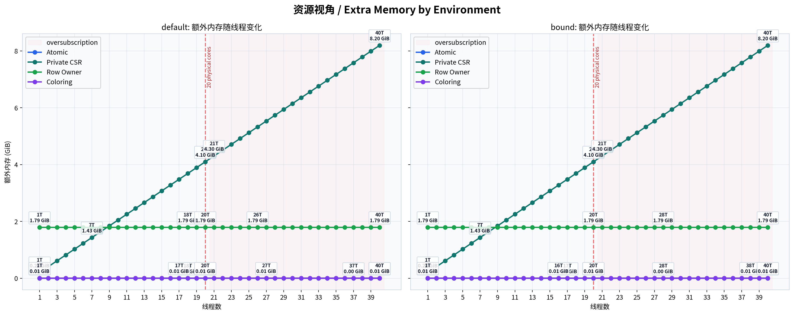
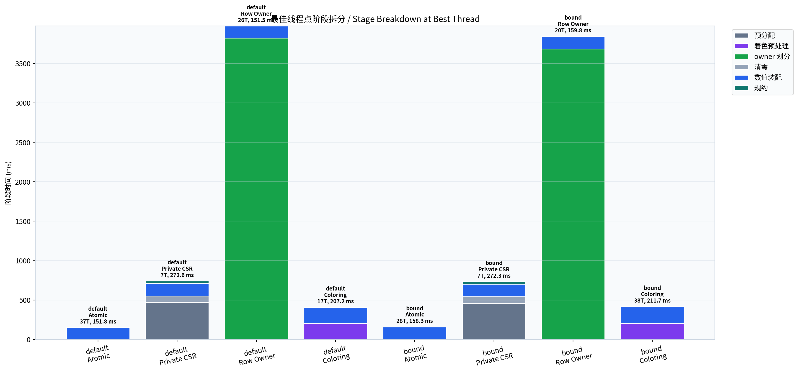
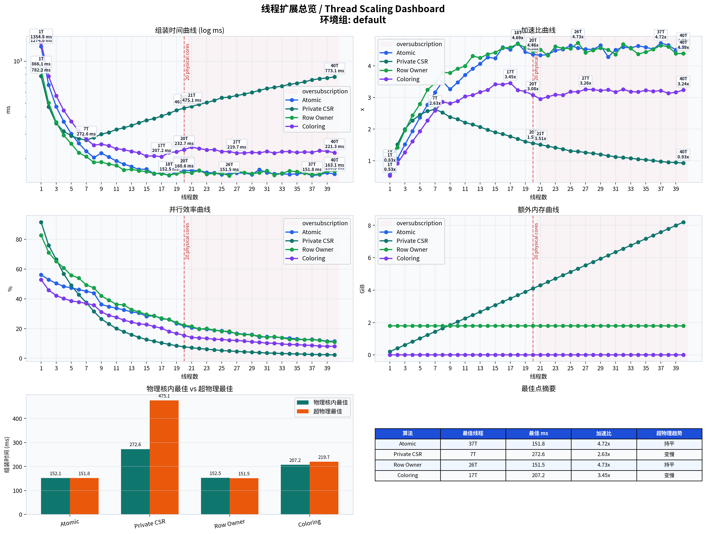
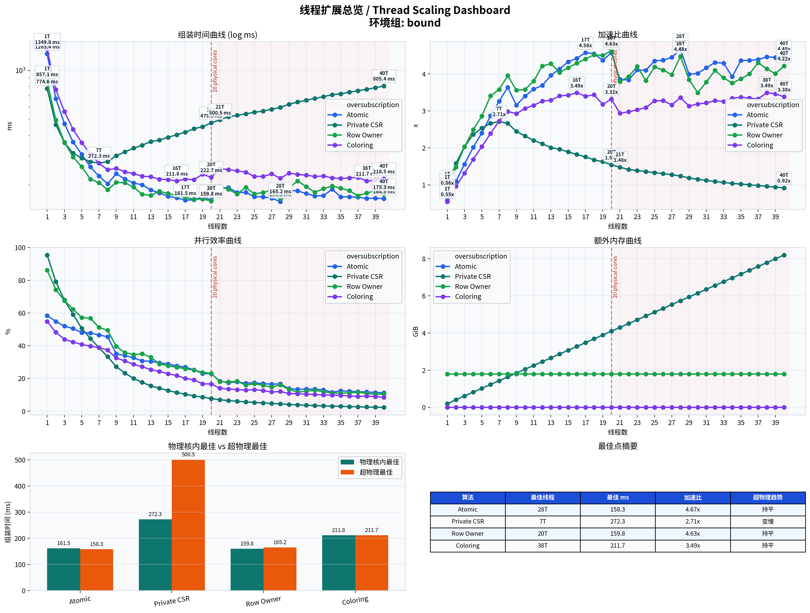

# 物理核/超物理线程扩展评估报告

## 实验设置

- case: `3d-WindTurbineHub`
- kernel: `physics_tet4`
- CPU: `Intel(R) Core(TM) Ultra 7 265KF`，physical_cores=20，logical_cores=20
- 线程范围: `1..40`
- 算法范围: `atomic`, `private_csr`, `row_owner`, `coloring`
- 判定阈值: 超过物理核后的最佳组装时间相对物理核内最佳值改善/退化超过 `5%`，分别判为继续加速/变慢；否则判为基本持平。

## 核区间定义

- 物理核内扩展区间: `1..20`。
- 当前平台 `physical_cores == logical_cores == 20`，没有 SMT/超线程暴露出来的真实逻辑核区间。
- 超过物理核后的区间: `21..40`，在本机语义上是 oversubscription，不是真实逻辑核加速。

<!-- thread-scaling-figures:start -->
## 可视化图表

核心图表已生成到 `figures/`。Markdown 中嵌入 PNG 以保证 GitHub、本地预览和普通浏览器都能直接显示；每张图同时提供 SVG 版本用于放大检查。

### 关键对比与瓶颈总览

[physical vs oversubscription SVG](figures/thread_scaling_physical_vs_oversubscription.svg)

[extra memory by environment SVG](figures/thread_scaling_memory_by_env.svg)

[stage breakdown best SVG](figures/thread_scaling_stage_breakdown_best.svg)

完整图表索引见 [figures/summary.md](figures/summary.md)。

<!-- thread-scaling-figures:end -->

## 主结论

### 环境组 `default`

<!-- thread-scaling-default-dashboard:start -->

[default dashboard SVG](figures/thread_scaling_default_dashboard.svg)

<!-- thread-scaling-default-dashboard:end -->

- OpenMP 设置: 默认调度，脚本运行时清空 `OMP_DYNAMIC` / `OMP_PROC_BIND` / `OMP_PLACES`。

| 算法 | 物理核内最佳 | 物理核内自扩展 | 超过物理核后最佳 | 趋势 | 主要瓶颈 |
| --- | --- | ---: | --- | --- | --- |
| `cpu_atomic` | `18T`, 152.052 ms, serial speedup 4.708x | 8.383x | `37T`, 151.782 ms, serial speedup 4.717x | 基本持平 | 主要瓶颈是共享 CSR value 上的 atomic update、缓存一致性流量和热点写入竞争；线程超过物理核后，同一批写热点会被更多软件线程竞争。 |
| `cpu_private_csr` | `7T`, 272.623 ms, serial speedup 2.626x | 2.869x | `21T`, 475.122 ms, serial speedup 1.507x | 变慢 | 主要瓶颈是每线程一份 CSR values 带来的内存容量、清零和 reduction 成本；线程越多，额外内存和归并带宽压力越明显。 |
| `cpu_row_owner` | `18T`, 152.498 ms, serial speedup 4.695x | 5.679x | `26T`, 151.513 ms, serial speedup 4.725x | 基本持平 | 主要瓶颈是 owner 划分后的负载均衡、任务列表内存，以及跨 owner 单元重复计算局部刚度矩阵；超过物理核后重复计算更难换来真实执行资源。 |
| `cpu_graph_coloring` | `17T`, 207.242 ms, serial speedup 3.455x | 6.537x | `27T`, 219.727 ms, serial speedup 3.258x | 变慢 | 主要瓶颈是颜色组之间的串行屏障、颜色桶负载不均和每个颜色内部可并行元素数量不足；线程增加后容易受同步和短任务调度限制。 |

### 环境组 `bound`

<!-- thread-scaling-bound-dashboard:start -->

[bound dashboard SVG](figures/thread_scaling_bound_dashboard.svg)

<!-- thread-scaling-bound-dashboard:end -->

- OpenMP 设置: `OMP_DYNAMIC=FALSE`, `OMP_PROC_BIND=close`, `OMP_PLACES=cores`。

| 算法 | 物理核内最佳 | 物理核内自扩展 | 超过物理核后最佳 | 趋势 | 主要瓶颈 |
| --- | --- | ---: | --- | --- | --- |
| `cpu_atomic` | `17T`, 161.543 ms, serial speedup 4.576x | 7.833x | `28T`, 158.345 ms, serial speedup 4.669x | 基本持平 | 主要瓶颈是共享 CSR value 上的 atomic update、缓存一致性流量和热点写入竞争；线程超过物理核后，同一批写热点会被更多软件线程竞争。 |
| `cpu_private_csr` | `7T`, 272.294 ms, serial speedup 2.715x | 2.845x | `21T`, 500.461 ms, serial speedup 1.477x | 变慢 | 主要瓶颈是每线程一份 CSR values 带来的内存容量、清零和 reduction 成本；线程越多，额外内存和归并带宽压力越明显。 |
| `cpu_row_owner` | `20T`, 159.806 ms, serial speedup 4.626x | 5.363x | `28T`, 165.188 ms, serial speedup 4.475x | 基本持平 | 主要瓶颈是 owner 划分后的负载均衡、任务列表内存，以及跨 owner 单元重复计算局部刚度矩阵；超过物理核后重复计算更难换来真实执行资源。 |
| `cpu_graph_coloring` | `16T`, 211.766 ms, serial speedup 3.491x | 6.374x | `38T`, 211.668 ms, serial speedup 3.493x | 基本持平 | 主要瓶颈是颜色组之间的串行屏障、颜色桶负载不均和每个颜色内部可并行元素数量不足；线程增加后容易受同步和短任务调度限制。 |

## 解释边界

本报告只回答 CPU 并行组装算法在物理核内和超过物理核后的线程扩展表现；它不重开符号/无符号组装主线，也不把 `coo_sort_reduce` 纳入本次 full matrix。在当前 `Intel(R) Core(TM) Ultra 7 265KF` 上，`physical_cores == logical_cores == 20`，超过 20 线程代表软件线程过量订阅，不能被解读为 SMT 逻辑核收益。
